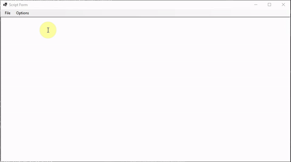

# Oscetch.ScriptComponent
A small project for having compilation capability of c# code in a piece of software 

## Installation

Clone the project `git clone https://github.com/Oscetch/Osctech.ScriptComponent.git`

## Build

Open the project in Visual Studio 2019+ and build. 
Then add the appropriate dlls to your project

## Usage

### Oscetch.ScriptComponent

The project called `Oscetch.ScriptComponent` is a library which helps load built dlls dynamically. 
Say you have a main project which should be able to handle user-generated code. 
In this main project we have a interface that looks like this:
```csharp
using Oscetch.ScriptComponent;

namespace test
{
    public interface ITestScript : IScript
    {
        int Sum(int n1, int n2);
    }
}
```
A user has written a mod using that interface that looks like this:
```csharp
using test;

namespace SomeAssembly
{
    public class Test : ScriptLoaderTest.ITestScript
    {
        public int Sum(int n1, int n2)
        {
            return n1 + n2;
        }
    }
}
```

We can then load it in our main project like this at runtime
```csharp
using Oscetch.ScriptComponent;

namespace test
{
    public class UserGeneratedCodeHandler
    {
        public ITestScript GetScript(string userDllPath, string userClassFullName)
        {
            var scriptReference = new ScriptReference(userDllPath, 
                            userClassFullName);

            if(ScriptLoader.TryLoadScriptReference<ITestScript>(scriptReference, out var script))
            {
                throw new Exception("Unable to load script");
            }

            return script;
        }
    }
}
```

In this example we generate a `ScriptReference` inside the GetScript method, but a more sensible method is probably to get that reference when the dll is compiled and storing it in a database, json or xml file instead.

### Oscetch.ScriptComponent.Compiler

Take the previous example, but this time imagine we're also compiling the user dll that contains the script we want to use.
This (obviously) requires we have a textbox that the user can write code in or we can load a .txt/.cs file which the user selects.
We also need to setup limitations on that input for which libraries the user may use before compiling, otherwise this gets much too complicated.
So say we have that in place, we can have a method that compiles it like this:
```csharp
using System;
using System.Collections.Generic;
using Oscetch.ScriptComponent;
using Oscetch.ScriptComponent.Compiler;
using Oscetch.ScriptComponent.Compiler.Extensions;
using Microsoft.CodeAnalysis;
using Microsoft.CodeAnalysis.CSharp;

public class CompilationException : Exception
{
    public ImmutableArray<Diagnostic> Diagnostics { get; }

    public CompilationException(ImmutableArray<Diagnostic> diagnostics)
        : base("Compilation error")
    {
        Diagnostics = diagnostics;
    }
}

public class MyCompiler
{
    public List<string> DllReferencesTheUserMayUse { get; }
        = new ();
    public string UserGeneratedDllsDirectory { get; set; } = "C:\\somewhereGood";

    public List<ScriptReference> CompileUserCode(string code)
    {
        // The out parameter is a list of errors that occurred fetching the references
        // Im ignoring that now since the compilation diagnostics will probably give a better error messaage anyway
        var references = AssemblyHelper.GetAssemblies(_settings.References, out _).ToMetadata();

        var syntaxTree = CSharpSyntaxTree.ParseText(code);

        if(!OscetchCompiler.Compile("UserTestAssembly", new []{ syntaxTree }, references, 
                out var tempDll, out var diagnostics))
        {
            throw new CompilationException(diagnostics);
        }

        var dllPath = Path.Join(UserGeneratedDllsDirectory, "UserTestAssembly.dll");
        File.Copy(tempDll, dllPath, true);
        return syntaxTree.GetScriptReferences(dllPath).ToList();
    }
} 
``` 

## Example application

If you need direction or are looking for a place to start, check out the project called `Oscetch.ScriptToolExample`. 


